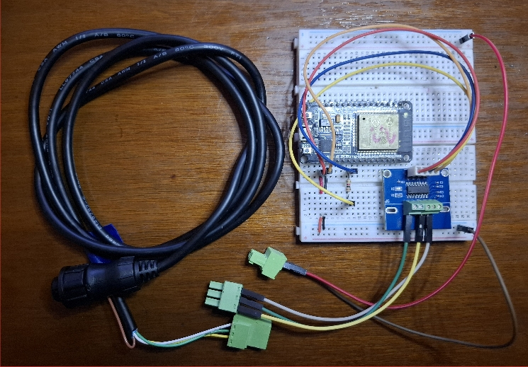

# NMEA 0183 History


**[Home](readme.md)** --
**History**

### Original ESP32 breadboard

On the breadboard, I only use the green -VE which is common to the brown -VE.

It looks like, in addition to the common NME0183 Input/Output (green/brown)
-ve grounds from the E80, I also had a common GND to the E80 power supply
and the ESP32.

[](images/ESP32_breadboard_large.jpg)

The other thing of note is that I had a 1K resistor in-line from the RS232
RXD to the ESP32 RXD pin, although that should not be necessary since the
MAX3232 chip *appears* to use 3.3V logic if connected to 3.3V power.


### List of NMEA0183 sentences the E80 purports to send (at 4800 baud)

- APB = Autopilot Sentence "B"
- BWC = Bearing and Distance to Waypoint – Latitude, N/S, Longitude, E/W, UTC, Status
- BWR = Bearing and Distance to Waypoint – Rhumb Line Latitude, N/S, Longitude, E/W, UTC, Status
- DBT = Depth Below Transducer
- DPT = Depth with optional transducer offset
- GGA = Global Positioning System Fix Data. Time, Position and fix related data
- GLL = Geographic Position – Latitude/Longitude
- MTW = Water Temperature
- MWV = Wind Speed and Angle
- RMA = Recommended Minimum Navigation Information
- RMB = Recommended Minimum Navigation Information
- RMC = Recommended Minimum Navigation Information
- RMD = Recommended Minimum Navigation Information
- RTE = Routes
- TTM = Tracked Target Message
- VHW = Water Speed and Heading
- VLW = Distance Traveled through Water
- WPL = Waypoint Location
- VTG = Track made good and speed over ground


### Yay Moment

I *think* that possibly the E80 only transmits information
when in "AIS38400" mode.

At some point I got my first NMEA0183 message from the E80.
It appears to send some kind of a proprietary information request
after booting.

**YAY!!! - I GOT THE "$DUAIQ,TXS*3B" messages!
with console.pm at 38400 and E80 setup similarly.**

I also seemed to get a message at 4800 when leaving simulation
mode on the e80 with garbage at the front:

```
series of junk characters then $VWVHW,,,284.6,M,,,,*23
```

"$VWVHW,,,284.6,M,,,,*23" indicates the wind speed and direction.
Specifically, it shows a wind direction of 284.6 degrees true and
a wind speed of 0 knots relative to the vessel (indicated by the
missing values in the second and third fields). The "M" indicates
that the wind speed is given in knots"


### Common 12V Ground to E80 Needed?

2nd TEST - try using the GREEN as the (common ground)
and add the WHITE as the AIS had it.
No JOY (but I had console.pm at wrong baud rate)

3rd TEST - try using E80 12V ground as signal ground
black wire from power supply
WORKS!!! BEST SOLUTION

**Done!!** Back to [**Home**](readme.md) ...
