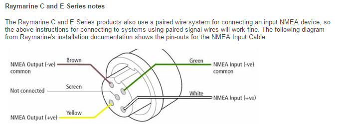
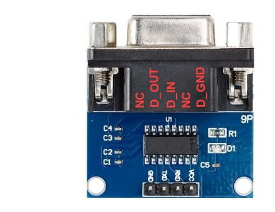

# NMEA 0183 and GX2410GPS

 TODO: test the RS232 module at 3.3V

**Home** --
**[History](history.md)** 

The NMEA0183 protocol is lame, allowing only a single TALKER per bus, with
multiple LISTENERS, the opposite of what would be useful. Nonetheless,
it is needed on the boat

- **AIS Data to E80** - The fundamental onboard requirement is that the
  E80 receives AIS data from the VHF Radio.
- **Monitoring AIS** - The second onboard requirement is to be able to monitor
  the AIS data being sent to the E80 by the VHF (in this program)
- **Desktop Unit Testing** - The third requirement is to be able to test
  E80's, ST50 Series Instruments, and the VHF radio off the boat,
  on the workbench.
- **Monitoring the E80 NMEA0183 data** onboard would be a *nicety*,
  and I believe it *could* be done by setting up a separate RS232
  module dedicated to listening to the yellow output+ from the E80
  (which is envisioned to be disconnected in the actual boat
  installation).
- **Monitoring the VHF GPS data** could also probably be acheived
  by a separate *third* RS232 module, but in the end, I think
  this is going a bit far, esp as I can monitor it well on the
  NMEA2000 bus.

In no case do I want to **require** an MPU to be preent on the boat.
And just to be sure, with the final VHF->E80+ESP21 configation I
verified that having the ESP32 depowered did not interfere with the
NMEA0183 AIS from the VHF to the E80.

FWIW, everyone is using 38400 baud for NMEA0183 data.

### History Overview

This project started as an experiment to see if I could communicate with
an E80 via NMEA0183.  After trials and tribulations, waiting for RS422 modules,
I was finally able to communicate with the E80 using an onhand RS232 adapter.

I then expanded the program so that I could "drive" the E80 with a simulator
over the NMEA0183 port using a Serial Console to the ESP32.

While currently preparing to install the (used) E80 and (new) VHF radio into my boat
I am thinking of switching to a teensy4.0 because of its superior support for multiple comm ports.
I would continue using the RS232 Serial Modules, rather than the RS422 modules
I acquired, as the RS232 Serial Module appears to support 3.3V logic, compatible with
the teensy.

#### E80 NMEA0183 cable

The E80 has a 5 pin connector for NMEA0183.

Clockwise, facing, from notch:

	GREEN   = NMEA Input negative (common -VE)
	WHITE   = NMEA Input positive
	YELLOW  = NMEA Output positive
	BROWN   = NMEA Output negative (common -VE)
	SCREEN  = center pin, not connected

### RS232 Module

The RS232 module is based on the MAX3232 ic which appears to support
3.3V logic if supplied with 3.3V VCC.
It has a four pin Dupont labelled header, from left to right
in below photo.

	GND
	TXD = data TO the RS232 port; Connected to TX2 (GPIO17) on the ESP32
	RXD = data FROM the RS232 port Conneted to RX2 (GPIO16) on the ESP32
	VCC = 3.3V

I desoldered the DB9 connector which was connected to the
row of 5 pins (with the row of 4 pins not connected).
From left to right in above photo, those 5 pins map to the
following:

	pin1 NC    = DCD no connection
	pin2 D_OUT = data to connected device
	pin3 D_IN  = data from connected device
	pin4 NC    = DCR no connection
	pin5 D_GND = data common ground

NOTE THAT MOST PUBLISHED PINOUTS of an rs232 DB9 connector appear to
be from the perspective of the person who plugs into it, and not
from the plug itself.  So, typically pin2 is called TXD even though
it is the pin that RECEIVES data on my module, so I call it D_IN.

#### ESP32 to the RS232 Module

I am using an unmodified premade JST 4 pin wired header with dupont
pins to connect the ESP32 to the RS232 module.  For completeness,
it is wired as follows:

   ESP32    dupont wire    JST4 on RS232 module
   --------------------------------------------
   GND      orange		   GND    connected to D_GND (DB9 pin5)
   TX2(17)  blue           TX     data TO the RS232 port goes to my D_OUT (DB9 pin2)
   RX2(16)  yellow         RX     data FROM the RS232 port comes from my D_IN (DB8 pin3)
   VIN      red            VCC    note that I am currently using 5V!

I hsve not tried it with 3.3V logic levels yet.

### Connecting to the E80 (Simulator, Desktop Testing)

The RS232 module DB9 connector is wired to a 3 pin Pheonix female connector
so it has a DB9 "side" with certain colored wires.  There are separete male
"device side" Pheonix connectors, with different colored wires for the E80
and the VHF.

I did the E80 first, so the colors of the wires out of the DB9 connector
just happen to match the E80 wire colors.

	DB9            wire  connector   E80 NMEA0183 cable wire
	----------------------------------------------------------------
	GND (pin5)	   green    XXxx     green  (E80 ve- common)
	D_IN (pin3)    yellow   XXxx     yellow (E80 NMEA Output positive)
	D_OUT (pin2)   white    XXxx     white  (E80 NMEA Input positive)

With this "most standard" wiring, I can control the E80 from the INO program
which forms a basis (in addition to the Seatalk program and it's simulator)
for desktop testing of th eE80.

### Connecting to the VHF

The VHF documentation is horrible. In the "Connections" section,
instead of giving a clear description of each wire, gives
you a full page with two "connection examples" with superscripted
notes and a monkey-do list of how to hook it up with a confusing
note.

There is a comment regarding grounding which is relevant, with
colors in asterisks added by me:

	NOTE: Some GPS chartplotters have a single wire for NMEA signal ground.
	In this case, connect the *green* NMEA input (-) to the GPS chartplotters
	single NMEA signal ground wire, and leave the *brown* NMEA output (-) open.

I have a common 12V ground and so ignore the rest of the comment:

	In case the assignment of power supply and ground of a GPS chart plotter
	to be used is different from that of the radio, connect the signal ground
	wire of the GPS chart plotter to the ground terminal (GND) on the rear
	panel of the radio.

BTW, the E80 pinout diagram implies that, on the E80, the green (input -)
snd brown (output -) are common. I generally use the green (input -) on
the E80 in the same way as recommended above for the VHF.

####  Better Names for Wires

In truth, it appears that one set of wires outputs GPS
information, and the other outputs AIS information, and either
of their baud rates can be selected at 4800 or 38400.

	yellow   GPS Input +
	green    GPS Input -
	white    GPS Output +
	brown    GPS Output -
	blue     AIS Output +
	grey     AIS Output -

Adding DSC to naming convention, as they do in the
documentation, only makes it more confusing.

#### Configuring the Baud Rate, Sentences, and Output

Furthermore, it appears likely that all sets of wires
operate at 4800 or 38400 baud according to the long press
GPS configuration menu setting, even though the the baud rate
applies to the AIS wires as well as the GPS Wires.

- GPS
  - NMEA-0183 IN OUT
    - DATA SPEED set to 38400
  - OUTPUT SENTENCES
    - all turned on
  - INTERNAL GPS UNIT
    - POS DATA OUTPUT
	  - NMEA2000 on
	  - NMEA0183 on
	- PINNING (on or off)

There is also a list of enable transmit GPS NMEA0183
sentences that csn be turned off or on. I hsve
turned them all on for testing.

Also, you can turn the GPS output on or off for NMEA0183
and NMEA2000 separately in this section. I have enabled
"position output" for both NMEA2000 and NMEA0183 for testing.

### VHF AIS data -> ESP32 (default VHF connection)

With GPS-NMEA0183-OUTPUT_SPEED set to 38400 baud, all GPS
OUTPUT SENTENCES turned on, and turning off the "PINNED" state
of the radio, after hooking it up as below, I got AIS sentences
(but only AIS sentences - no GPS sentences) into the INO program
via the RS232 module

	DB9            wire  connector   VHF confusing wires
	----------------------------------------------------------------
	GND (pin5)	   green    XXxx     green  (GPS Input- and common ground according to doc)
	D_IN (pin3)    yellow   XXxx     blue   (AIS Data Output+)
	D_OUT (pin2)   white    XXxx     yellow (GPS Input+)

In this configuration I was also able to spoof the VHF into
receiving position information once I sent it GPS Satellite
messages GSA and GSV (below).

#### VHF GPS data -> ESP32

Then, as an experiment, I hooked up the VHF white wire to D_IN and started
getting GPS information (once again, after setting to output all GPS sentences
and not "pin" the radio to a given location).

	DB9            wire  connector   VHF confusing wires
	----------------------------------------------------------------
	GND (pin5)	   green    XXxx     green  (GPS Input- and common ground according to doc)
	D_IN (pin3)    yellow   XXxx     white  (GPS Data Output+)
	D_OUT (pin2)   white    XXxx     yellow (GPS Input+)

This is when I realized just how bad the documentation is and decided
to rework my own documentation to reflect reality as best I can.

The bottom line is that there are two separate sets of wires for output
from the VHF for NMEA0183 ... blue+/grey- for AIS messages and white+/brown-
for GPS messags.

#### Simulator GPS data -> VHF

Working with an AI, I added the ability to send some simple pre-recorded
GSV (Satellites in View) and GSA (Satellite Information) NMEA0183 messages
to the VHF (#if WITH_GPS_SATELLITES in simulator.cpp, which already sends out GLL
and RMC sentences) over the single ended RS232 GPS input + (white) using the
"default VHF connection".

Spoofing the VHF is not something I plan on doing on the boat,
esp inasmuch as it has it's own GPS and the E80 WILL switch over to it
(on the NMEA2000 bus) if, for some reason, the Seatalk GPS goes offline.

However, as  proof of concept, I DID get it working.

### VHF AIS data -> E80

It took me a while to figure out that the VHF doesn't have enough *oomph*
as a single ended connection (using the VHF green common negative) to drive
the E80.  I discovered that I needed to specifically use the blue AIS data -
wire instead of the green common negative wire, at which point the E80
started showing AIS information.  Note that, like the VHF, the E80 will
not show AIS information until it has a GPS fix, and that it can take a long
time for enough AIS messages to hit the E80 to turn the "AIS arrow" indicator
on and start showing the purple triangle targets.

	VHF                 E80
	blue AIS+           white NMEA input+
	grey AIS-           green NMAA common-

Note that I did not even bother to try to send NMEA0183 data from the
E80 to VHF.  It just got too complicated. See note in requirements about
spoofing the VHF.

#### VHF AIS data -> E80+ESP32

I was able to get two listeners (the RS232 module and the E80) to work
with a rather complicated setup.  As before I use the blue+/grey- to the
E80 white+/green- wires, but in addition I connect the blue+ to the RS232
yellow D_IN wire AND the VHF common green- to the RS232 single point
ground green D_GND wire.

	VHF                 E80                   RS232 module
	blue AIS+           white NMEA input+     yellow D_IN wire
	grey AIS-           green NMAA common-
	green common GPS-                         green D_GRND wire

and finally I am able to monitor the VHF AIS messages on the ESP32
(in this program) at the same time as they are successfully sent to the E80

### AIS Integration Note regarding NMEA2000 and Seatalk

Note once again that for the E80 to display AIS information it must
have a GPS fix.   When both the VHF and E80 are hooked up to the
NMEA2000 bus the E80 succesfully gets a fix (and satellite information)
over NMEA2000.  Unfortunately the E80 DOESNT get AIS information over
NMEA2000, even though I can clearly see (and have decoded) the PGN's.

The other way to "trick" the E80 into having a position fix is with
the Seatalk simulator.  In either case, once it starts working,
the E80 (slowly) starts showing the AIS arrow and purple target
triangles.  It can take a long time, particularly as the VHF GPS
can take many minutes to locate satellites inside the apartment.
The situation improved significantly when I added an old passive
GPS antenna to the VHF.

**Next:** [**History**](history.md) of my E80-NMEA0183 experiments ...